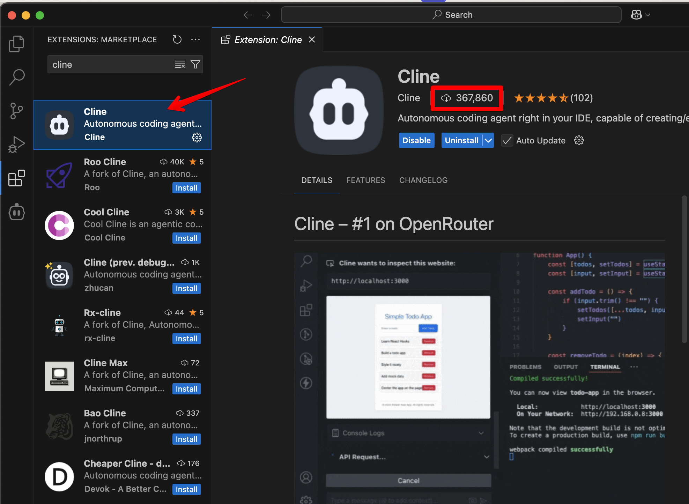

# Automatizando frontend com Cline: do Zero ao Tique-Taque

Você já imaginou criar um aplicativo funcional, estiloso e com código limpo em poucos passos? É exatamente isso que o Cline permite! Quando descobri essa ferramenta no Visual Studio Code, fiquei impressionado com sua capacidade de gerar soluções completas com base em prompts bem elaborados.

Neste artigo, vou compartilhar como usei o Cline para criar o Tique-Taque, um cronômetro com temporizador que combina Vue 3, TypeScript e Tailwind CSS. Além disso, vou mostrar como configurar tudo de forma simples, desde a instalação até o deploy no GitHub Pages. Prepare-se para explorar o poder da automação e, quem sabe, incorporar isso nos seus próprios projetos!

Mais sobre o Cline: https://github.com/cline/cline

Instalação:

Direto pelo VS Code, via extensões, procurar por Cline. Disclaimer: cuidado que há similares com um menor número de downloads e que podem não nos atender bem além de poder conter algo malicioso.

Para abrir as configurações do Cline, pressione CMD/Control + Shift + P e digite “Cline: Open in New Tab”

Algo como isso deverá aparecer:

No Api Provider, selecione algum que você possua conta e uma Api Key. Nesse exemplo usaremos a API Key do [deepseek](https://www.deepseek.com). Em um outro conteúdo explicarei mais sobre o deepseek.

Testando seu uso pela primeira vez:

Nosso projeto será um Crônometro com Temporizador.

Vamos criar uma pasta para nosso projeto chamada TiqueTaque e abra-a no VSCode. 

Clique no botão do Cline no menu esquerdo:

E insira o seguinte prompt:

**Criar um temporizador “Tique-Taque” com Vue 3, TypeScript e Tailwind CSS**

Desenvolva um pequeno aplicativo chamado **Tique-Taque**, que funcione como um temporizador. Ele deve ser criado usando **Vue 3** como framework, **TypeScript** para a lógica e **Tailwind CSS** para estilização. O aplicativo terá as seguintes funcionalidades e layout:

1.	**Cronômetro:**

•	Deve incluir botões para **iniciar**, **parar** e **zerar** o tempo.

•	O tempo será exibido no formato MM:SS (minutos e segundos).

•	O cronômetro começará do 00:00 e incrementará a cada segundo.

2.	**Temporizador:**

•	Deve permitir que o usuário insira minutos e segundos para contagem regressiva.

•	Um botão para **Iniciar Temporizador** começará a contagem regressiva.

•	Quando o tempo chegar a 00:00, um alerta deve ser exibido, como uma mensagem no console ou um efeito visual.

3.	**Layout:**

•	Página centralizada, com título “Tique-Taque” no topo.

•	Uma área grande no centro que exiba o tempo em um estilo moderno e legível.

•	Botões para **Iniciar**, **Parar** e **Zerar** alinhados horizontalmente.

•	Uma área abaixo com campos de entrada para inserir o tempo do temporizador, com um botão para iniciar.

•	Visual clean e responsivo, utilizando cores suaves (branco, cinza e verde para botões ativos).

4.	**Tecnologias:**

•	**Vue 3**: Usar componentes para organização e ref ou reactive para estado local.

•	**TypeScript**: Adicionar tipagem para entradas e funções.

•	**Tailwind CSS**: Criar o layout centralizado e estilizar botões, textos e campos.

•	Responsividade para desktop e mobile.

5.	**Comportamento do Código:**

•	O botão “Iniciar” do cronômetro começa a contagem progressiva de 0.

•	O botão “Parar” pausa o cronômetro ou temporizador no estado atual.

•	O botão “Zerar” redefine o tempo para 00:00.

•	O botão “Iniciar Temporizador” começa a contagem regressiva a partir do valor inserido pelo usuário.

•	Quando o temporizador termina, exibe uma mensagem no console ou uma animação.

**Resultado esperado:**

Um aplicativo funcional que exibe o tempo corretamente, possui interatividade completa e apresenta um layout limpo e responsivo. O código deve ser modular, com lógica separada da apresentação.

---

Aqui temos o primeiro retorno e o custo (muito barato!!!)

Após todas as execuções iniciais, esse foi o custo antes do comando npm run dev

**Isso mesmo! 0,0037 usd ou 0,0226 Reais!**

O resultado final foi esse, com zero edição de minha parte:

O layout pode melhorar muito, o temporizador ficou confuso na parte de baixo mas tudo ficou muito funcional!

Antes do deploy, irei colocar esse código no [github](https://github.com/). 

Uma coisa muito legal que aconteceu foi que ele tentou usar o [GH Cli](https://cli.github.com/) do Github e eu ainda não havia instalado e ele mesmo percebeu e partiu para a instalação!

O repositório é esse: https://github.com/felipebossolani/tiquetaqueai

E, por último, iremos subi-lo no github pages

Depois de alguns ajustes no github actions (faltava o personal access token configurado no repo), consegui finalizar!

[https://felipebossolani.github.io/TiqueTaqueAI/](https://felipebossolani.github.io/TiqueTaqueAI/)

**Uma observação importante: Para projetos profissionais sempre de preferência para modelos AI pagos e leia todos os EULAs sobre o uso e nunca compartilhe senhas e chaves com os modelos.**
